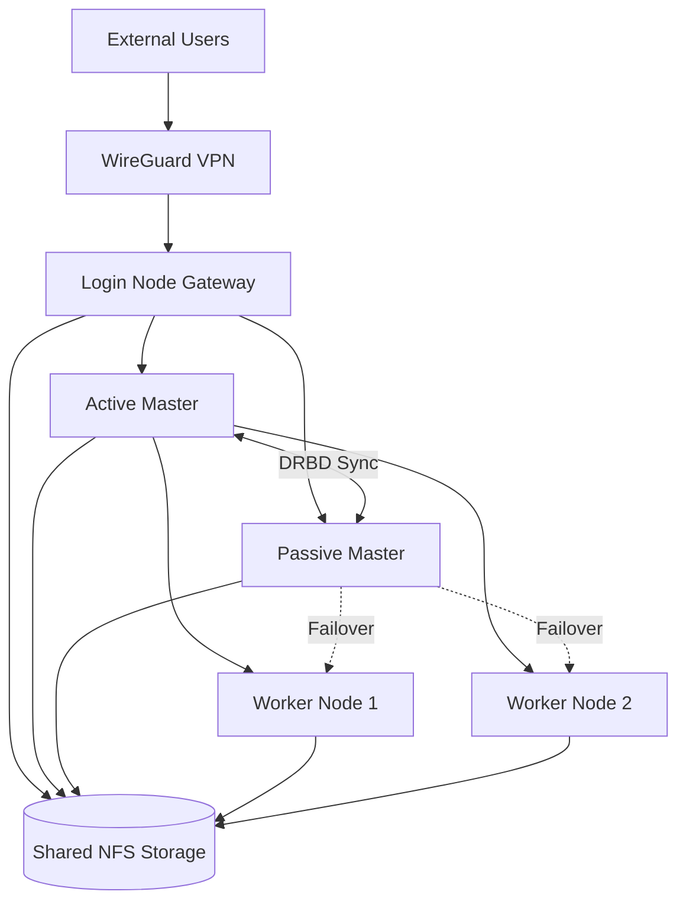
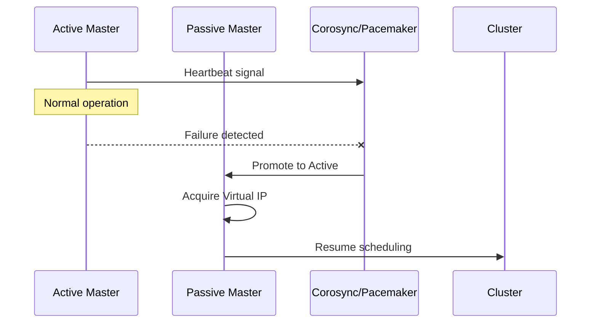
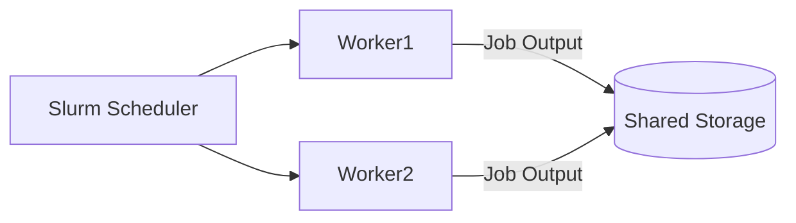
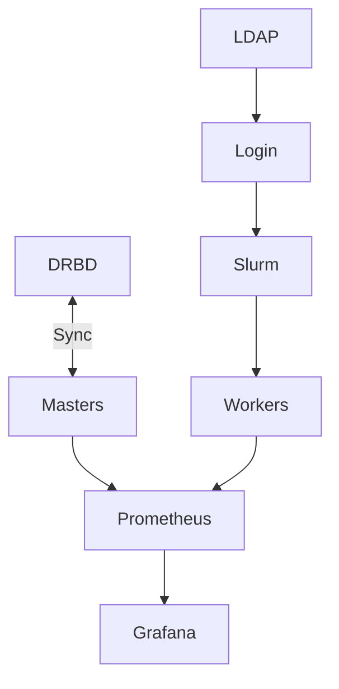

# High Availability HPC Cluster

A production-grade High Availability High Performance Computing (HPC) cluster designed for **fault tolerance, automated failover, secure remote access, and real-time observability**.

This project demonstrates how to engineer a resilient HPC environment using DRBD replication, Pacemaker/Corosync clustering, Slurm scheduling, centralized authentication, and Ansible automation.

---

## Architecture Overview


The system is built around an multi-layer architecture that separates access, control, and compute:



---

## System Architecture from Project Implementation


The architecture consists of:

### Login Node (Gateway)

The login node is the secure entry point to the cluster and provides:

* LDAP authentication and centralized identity
* DNS and DHCP network services
* NTP time synchronization
* NFS shared storage
* WireGuard VPN remote access
* Firewall enforcement
* User on-demand web portal

Users interact only through this node.

---

### Master Nodes (High Availability Core)

Two master nodes operate in active/passive mode.



Active Master:

* Runs Slurm controller
* Manages job queues
* Hosts monitoring stack

Passive Master:

* Mirrors active state via DRBD
* Automatically takes over on failure

No job data is lost during failover.

---

### Worker Nodes

Worker nodes execute distributed workloads.



They:

* Run Slurm execution daemons
* Access shared NFS storage
* Execute user jobs
* Receive automatic rescheduling if a node fails

---

## Technology Stack and Communication



### Core Technologies

**Slurm Workload Manager**

Handles job scheduling and resource allocation.

**Pacemaker + Corosync**

Provides cluster orchestration and automated failover.

**DRBD Replication**

Ensures synchronous storage replication between masters.

**NFS Shared Storage**

Delivers unified filesystem access across nodes.

**LDAP Authentication**

Centralized user identity and access control.

**WireGuard VPN**

Encrypted secure remote access.

**Prometheus + Grafana**

Real-time monitoring and visualization.

**HPL Benchmarking**

Validates distributed compute performance.

---

## System Workflow


1. User connects via VPN and web portal
2. LDAP authenticates identity
3. Jobs are stored on shared storage
4. Slurm schedules execution
5. Workers process tasks
6. Monitoring tracks performance
7. Results are stored centrally

Failover activates automatically on node failure.

---

## Monitoring and Performance Validation


The monitoring stack provides:

* Real-time node health visualization
* Resource utilization dashboards
* Slurm job analytics
* Failover detection
* Performance trends

HPL benchmarking validates cluster performance under full load.

---

## Automated Deployment with Ansible

The cluster is fully deployable using automation.

### Setup Steps

Clone the repository:

```
git clone https://github.com/Prince-Philip-06/High-Availability-HPC-Cluster-.git
cd High-Availability-HPC-Cluster
```

Configure inventory:

[https://github.com/Prince-Philip-06/High-Availability-HPC-Cluster-/tree/main/ansible/inventory](https://github.com/Prince-Philip-06/High-Availability-HPC-Cluster-/tree/main/ansible/inventory)

Run deployment playbooks:

```
ansible-playbook ansible/playbooks/deploy-cluster.yml
```

Playbooks:

[https://github.com/Prince-Philip-06/High-Availability-HPC-Cluster-/tree/main/ansible/playbooks](https://github.com/Prince-Philip-06/High-Availability-HPC-Cluster-/tree/main/ansible/playbooks)

Cluster configurations:

[https://github.com/Prince-Philip-06/High-Availability-HPC-Cluster-/tree/main/configs](https://github.com/Prince-Philip-06/High-Availability-HPC-Cluster-/tree/main/configs)

---

## Project Documentation

Project report:

[https://github.com/Prince-Philip-06/High-Availability-HPC-Cluster-/blob/main/docs/High-Availability-HPC-Cluster-Report.pdf](https://github.com/Prince-Philip-06/High-Availability-HPC-Cluster-/blob/main/docs/High-Availability-HPC-Cluster-Report.pdf)

Project presentation:

[https://github.com/Prince-Philip-06/High-Availability-HPC-Cluster-/blob/main/docs/High-Availability-HPC-Cluster-Presentation.pptx](https://github.com/Prince-Philip-06/High-Availability-HPC-Cluster-/blob/main/docs/High-Availability-HPC-Cluster-Presentation.pptx)

Automation scripts:

[https://github.com/Prince-Philip-06/High-Availability-HPC-Cluster-/tree/main/ansible](https://github.com/Prince-Philip-06/High-Availability-HPC-Cluster-/tree/main/ansible)

---

## Failover Behavior

When the active master node fails:

1. Corosync detects heartbeat loss
2. Pacemaker migrates services
3. Virtual IP switches nodes
4. Passive master becomes active
5. Slurm resumes scheduling

Users experience uninterrupted execution.

---

## Security Model

The cluster uses layered security:

* VPN-only external access
* Firewall restrictions
* Private internal networking
* Centralized LDAP authentication
* Encrypted communication
* Role-based permissions

---

## Use Cases

This system supports:

* Scientific simulations
* Research computing
* Academic HPC labs
* Fault-tolerant infrastructure training
* Distributed analytics

---

## Future Improvements

* Cloud bursting integration
* Advanced checkpointing
* Automated alert notifications
* Container orchestration
* Scalable node expansion

---

## Conclusion

This project demonstrates a complete high availability HPC architecture combining redundancy, automation, performance, and security. The system delivers continuous operation, transparent failover, and scalable distributed computation.

Anyone following this documentation can reproduce the cluster and understand how modern HPC infrastructure is engineered.

---
