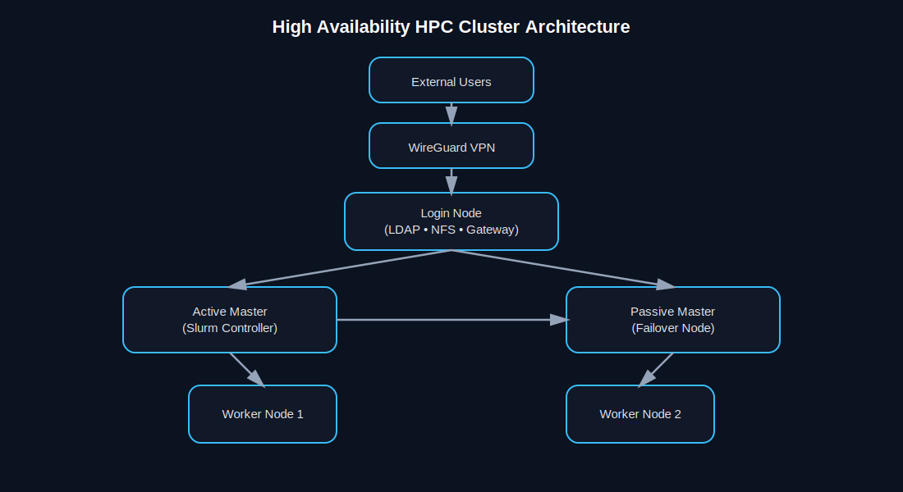
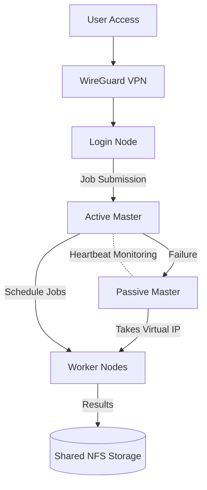
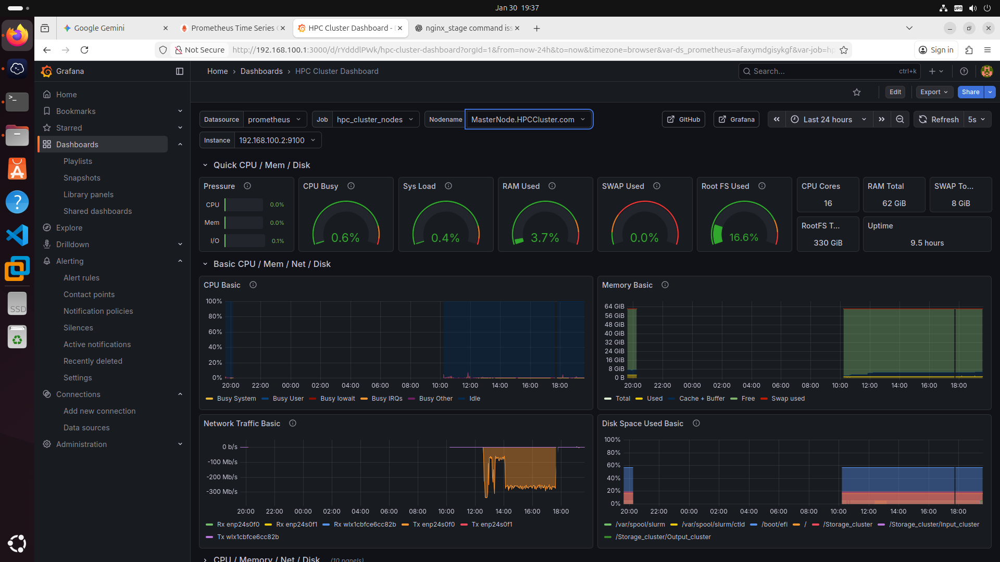
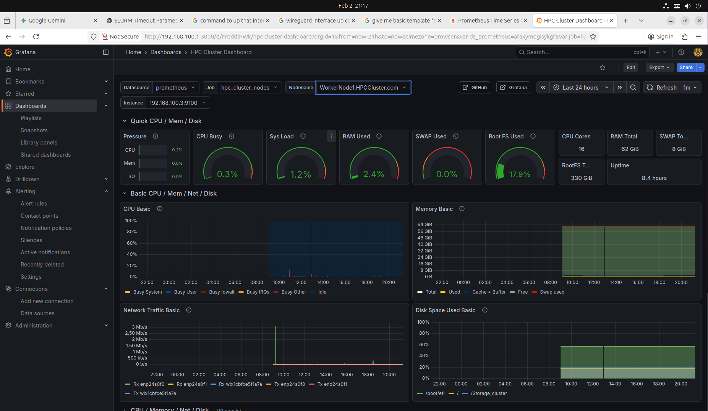
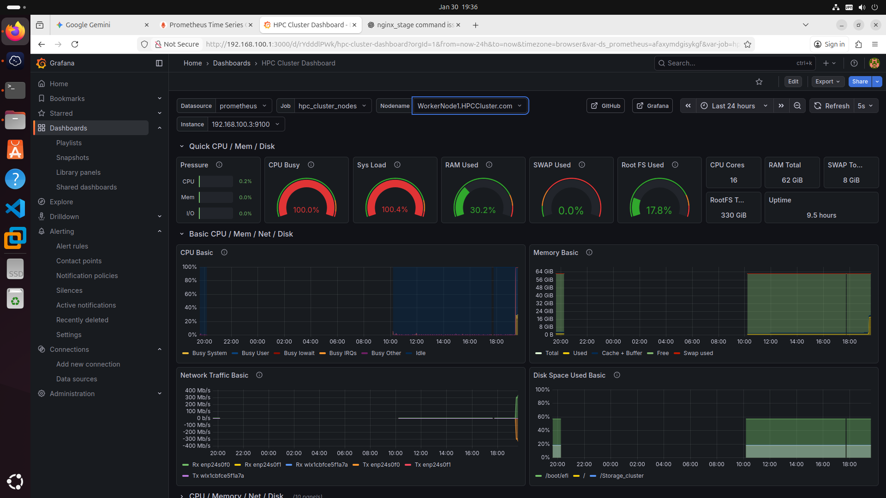

  

A production-grade **High Availability High Performance Computing (HPC) cluster** engineered for fault tolerance, automated failover, secure remote access, and real-time observability.

This project demonstrates how to design and deploy a resilient HPC environment using **Slurm scheduling, DRBD replication, PCS/Pacemaker clustering, centralized authentication, monitoring, and Ansible automation**. Full documentation is available in **[Report & Ppt](Report%20%26%20Ppt)**.

---

## Architecture Overview

  

The system architecture is divided into three logical layers:

* **Access Layer** — secure entry through VPN and login gateway
* **Control Layer** — redundant master nodes handling scheduling and failover
* **Compute Layer** — distributed worker nodes executing workloads

High availability is implemented using **[DRBD](DRBD)** for synchronous replication and **PCS/Pacemaker** clustering to eliminate single points of failure.

---

## System Flow

This flow illustrates secure access, centralized scheduling, automatic failover, and persistent shared storage.

---

## On-Demand Web Portal

The login node hosts a secure **browser-based on-demand portal** that allows users to interact with the cluster without direct administrative access.

Through the portal, users can:

* Access their home directories
* Upload and manage files
* Submit and monitor HPC jobs
* Execute tasks with user-level permissions

Authentication is handled via **[LDAP](LDAP)** and external access is secured using **[Wireguard](Wireguard)** VPN.

---

## Core Infrastructure Components

The cluster integrates several subsystems:

* **[DNS/bind](DNS/bind)** — name resolution
* **[LDAP](LDAP)** — centralized authentication
* **[NTP ( Chrony )](NTP%20%28%20Chrony%20%29)** — time synchronization
* **[DRBD](DRBD)** — storage replication
* **[Slurm_Files](Slurm_Files)** — workload scheduling
* **[Slurm_AnsibleScript](Slurm_AnsibleScript)** — automated deployment
* **[Monitoring & Alerting](Monitoring%20%26%20Alerting)** — Prometheus & Grafana
* **[HPL_Benchmarking](HPL_Benchmarking)** — performance validation

These components together create a self-healing HPC environment.

---

## Monitoring & Observability

Real-time system visibility is provided through Grafana dashboards configured in **[Monitoring & Alerting](Monitoring%20%26%20Alerting)**.

### Cluster Overview

  

### Worker Monitoring

  

### HPL Benchmark Monitoring

  

These dashboards display node health, resource utilization, and cluster load during benchmarking.

---

## Automated Deployment

Cluster provisioning and configuration are automated using playbooks inside **[Slurm_AnsibleScript](Slurm_AnsibleScript)**.

Update node inventory and configuration variables before executing the deployment scripts.

---

## Security Model

The cluster enforces layered security including:

* VPN-only external access
* Firewall isolation
* Private internal networking
* Centralized LDAP authentication
* Encrypted communication

---

## Performance Validation

Performance testing is implemented in **[HPL_Benchmarking](HPL_Benchmarking)**. HPL benchmarks confirm distributed compute efficiency and validate that high availability does not introduce performance penalties.

---

## Failover Behavior

When the active master node fails:

1. PCS detects heartbeat loss
2. Pacemaker migrates services
3. Virtual IP switches automatically
4. Passive master becomes active
5. Slurm resumes scheduling

Users experience uninterrupted execution.

---

## Use Cases

* Scientific simulations
* Research computing
* Academic HPC labs
* Fault-tolerant infrastructure training
* Distributed analytics workloads

---

## Conclusion

This project demonstrates a complete high-availability HPC architecture combining redundancy, automation, performance, and security.

It provides a practical blueprint for building modern resilient HPC environments capable of continuous operation and scalable distributed computation.
