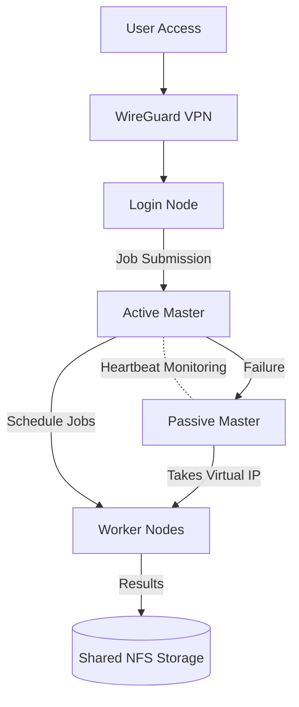

# High Availability HPC Cluster

<p align="center">
  
</p>

A production-grade **High Availability High Performance Computing (HPC) cluster** engineered for fault tolerance, automated failover, secure remote access, and real-time observability.

This project demonstrates how to design and deploy a resilient HPC environment using **Slurm scheduling, DRBD replication, Pacemaker/Corosync clustering, centralized authentication, and Ansible automation**. The complete implementation details are documented in the [project report](docs/High-Availability-HPC-Cluster-Report.pdf) and visually explained in the [project presentation](docs/High-Availability-HPC-Cluster-Presentation.pptx).

---

## Architecture Overview

<p align="center">
  
</p>

The system architecture is divided into three logical layers:

* **Access Layer** — secure entry through VPN and login gateway
* **Control Layer** — redundant master nodes handling scheduling and failover
* **Compute Layer** — distributed worker nodes executing workloads

The architectural decisions and implementation workflow are explained in the [technical report](docs/High-Availability-HPC-Cluster-Report.pdf).

---

## Animated System Flow

The animated diagram below illustrates how components communicate during normal operation and failover.



This flow represents secure access, centralized scheduling, automatic failover, and persistent shared storage.

---

## Cluster Components

### Login Node (Gateway)

The login node is the secure entry point to the cluster and provides LDAP authentication, DNS/DHCP networking, NTP synchronization, shared NFS storage, VPN access, and firewall enforcement.

Automation and configuration for this node are implemented in the [`login-node role`](ansible/roles/login-node) and supporting network configuration inside [`configs/network`](configs/network).

---

### Master Nodes (High Availability Core)

Two master nodes operate in **active/passive mode** to eliminate single points of failure.

The active master runs Slurm scheduling and monitoring services, while the passive master mirrors state using DRBD and automatically takes over during failure.

Failover configuration is defined in [`configs/pacemaker`](configs/pacemaker) and automated through the [master setup playbook](ansible/playbooks/master-setup.yml).

---

### Worker Nodes

Worker nodes execute distributed HPC workloads using Slurm execution daemons and shared NFS storage. Jobs are automatically rescheduled if a worker node becomes unavailable.

Worker provisioning is handled by the [`worker-node role`](ansible/roles/worker-node).

---

## Monitoring and Observability

Prometheus collects metrics from all nodes while Grafana visualizes real-time dashboards for cluster health and performance.

Monitoring configurations and dashboards are located in [`configs/monitoring`](configs/monitoring), and example dashboard outputs can be seen in the [presentation slides](docs/High-Availability-HPC-Cluster-Presentation.pptx).

---

## Automated Deployment

The entire cluster can be deployed using Ansible automation.

```bash
git clone <repository-url>
cd High-Availability-HPC-Cluster-
ansible-playbook ansible/playbooks/deploy-cluster.yml
```

Node definitions are configured in the [inventory file](ansible/inventory/hosts.ini). The automation installs networking services, authentication, storage, scheduling, monitoring, and failover components.

---

## Security Model

The cluster enforces layered security including VPN-only external access, firewall isolation, private networking, centralized LDAP authentication, and encrypted communication.

Security configurations are maintained in [`configs/security`](configs/security).

---

## Performance Validation

HPL benchmarking validates distributed compute performance and cluster stability under full load. Benchmark scripts are available in [`scripts/hpl-benchmark`](scripts/hpl-benchmark), and results are analyzed in the [project report](docs/High-Availability-HPC-Cluster-Report.pdf).

---

## Failover Behavior

When the active master node fails:

1. Corosync detects heartbeat loss
2. Pacemaker migrates services
3. Virtual IP switches to passive master
4. Passive master becomes active
5. Slurm resumes scheduling

Users experience uninterrupted execution.

---

## Use Cases

This architecture supports scientific simulations, research computing, academic HPC labs, and fault-tolerant infrastructure training.

---

## Conclusion

This project demonstrates a complete high-availability HPC architecture combining redundancy, automation, performance, and security. Using the provided documentation and automation, anyone can reproduce this cluster and understand how modern resilient HPC infrastructure is engineered.
