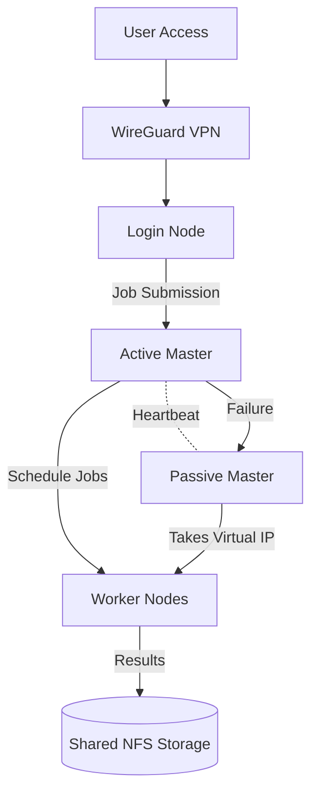

# High Availability HPC Cluster

<p align="center">
  
</p>

A production-grade **High Availability High Performance Computing (HPC) cluster** engineered for fault tolerance, automated failover, secure remote access, and real-time observability. This project demonstrates how modern HPC infrastructure can be built using DRBD replication, Pacemaker/Corosync clustering, Slurm scheduling, centralized authentication, and Ansible automation.

---

## Architecture Overview

Below is a clean professional architecture diagram (SVG) representing the full cluster topology.

<p align="center">

```svg
<svg width="900" height="520" xmlns="http://www.w3.org/2000/svg">
  <style>
    .box { fill:#0f172a; stroke:#38bdf8; stroke-width:2; rx:10; }
    .text { fill:white; font-family:Arial; font-size:14px; text-anchor:middle; }
    .arrow { stroke:#94a3b8; stroke-width:2; marker-end:url(#arrow); }
  </style>

  <defs>
    <marker id="arrow" markerWidth="10" markerHeight="10" refX="8" refY="3" orient="auto">
      <polygon points="0 0, 10 3, 0 6" fill="#94a3b8"/>
    </marker>
  </defs>

  <!-- Users -->
  <rect x="370" y="20" width="160" height="40" class="box"/>
  <text x="450" y="45" class="text">External Users</text>

  <!-- VPN -->
  <rect x="370" y="90" width="160" height="40" class="box"/>
  <text x="450" y="115" class="text">WireGuard VPN</text>

  <!-- Login -->
  <rect x="350" y="160" width="200" height="60" class="box"/>
  <text x="450" y="190" class="text">Login Node</text>
  <text x="450" y="208" class="text">(Gateway + LDAP + NFS)</text>

  <!-- Masters -->
  <rect x="150" y="260" width="200" height="70" class="box"/>
  <text x="250" y="295" class="text">Active Master</text>
  <text x="250" y="315" class="text">(Slurm + Monitoring)</text>

  <rect x="550" y="260" width="200" height="70" class="box"/>
  <text x="650" y="295" class="text">Passive Master</text>
  <text x="650" y="315" class="text">(Failover Node)</text>

  <!-- Workers -->
  <rect x="220" y="380" width="160" height="60" class="box"/>
  <text x="300" y="415" class="text">Worker Node 1</text>

  <rect x="520" y="380" width="160" height="60" class="box"/>
  <text x="600" y="415" class="text">Worker Node 2</text>

  <!-- Arrows -->
  <line x1="450" y1="60" x2="450" y2="90" class="arrow"/>
  <line x1="450" y1="130" x2="450" y2="160" class="arrow"/>
  <line x1="450" y1="220" x2="250" y2="260" class="arrow"/>
  <line x1="450" y1="220" x2="650" y2="260" class="arrow"/>
  <line x1="250" y1="330" x2="300" y2="380" class="arrow"/>
  <line x1="650" y1="330" x2="600" y2="380" class="arrow"/>
  <line x1="350" y1="295" x2="550" y2="295" class="arrow"/>
</svg>
```

</p>

The architecture separates **access**, **control**, and **compute layers** to eliminate single points of failure.

---

## Animated Architecture Flow

This animated Mermaid diagram explains how components interact during normal operation and failover.



The animation illustrates:

* User entry through secure VPN
* Job scheduling via the active master
* Continuous heartbeat monitoring
* Automatic failover to the passive master
* Persistent shared storage access

---

## Cluster Workflow

Users access the cluster through the login gateway, authenticate via LDAP, and submit jobs that are scheduled by Slurm and executed on worker nodes. Monitoring is continuously collected and visualized.

The real implementation and screenshots of dashboards can be seen in the project presentation and report located in
`docs/High-Availability-HPC-Cluster-Presentation.pptx` and
`docs/High-Availability-HPC-Cluster-Report.pdf`.

---

## Core Components

### Login Node (Gateway)

The login node is the secure entry point providing LDAP authentication, DNS/DHCP, NTP synchronization, NFS shared storage, and VPN access. Users interact with the system through the on-demand web portal and SSH.

Configuration examples and setup scripts are available in
`configs/network/` and automation roles in `ansible/roles/login-node/`.

---

### Master Nodes (High Availability Core)

Two masters operate in active/passive mode using DRBD replication and Pacemaker orchestration. The active master runs the Slurm controller and monitoring stack. The passive master mirrors state and instantly takes over during failure.

Cluster failover configuration is implemented in
`configs/pacemaker/` and automated via `ansible/playbooks/master-setup.yml`.

---

### Worker Nodes

Worker nodes execute distributed HPC workloads using Slurm daemons and shared NFS storage. Jobs are automatically rescheduled if a worker fails.

Worker provisioning scripts are located in
`ansible/roles/worker-node/`.

---

## Monitoring and Observability

Prometheus collects node metrics while Grafana visualizes real-time dashboards. Example dashboards and configuration files are stored in
`configs/monitoring/`.

During HPL benchmarking, Grafana dashboards demonstrate CPU saturation and cluster load distribution, as shown in the presentation slides.

---

## Automated Deployment

The cluster is fully reproducible using Ansible automation.

Clone the repository and run:

```
git clone <repository-url>
cd High-Availability-HPC-Cluster
ansible-playbook ansible/playbooks/deploy-cluster.yml
```

Inventory configuration is defined in
`ansible/inventory/hosts.ini`.

This deploys networking, authentication, storage, scheduling, monitoring, and failover automatically.

---

## Security Model

The system enforces layered security:

* VPN-only external access
* Firewall isolation
* Private cluster networking
* Centralized LDAP authentication
* Encrypted communication
* Role-based permissions

Security configurations are maintained in
`configs/security/`.

---

## Performance Validation

HPL benchmarking validates distributed compute performance and cluster stability under full load. Benchmark scripts are available in
`scripts/hpl-benchmark/`.

---

## Conclusion

This project demonstrates a complete high availability HPC architecture combining redundancy, automation, security, and performance. The system delivers continuous operation, transparent failover, and scalable distributed computation.

Following the documentation and automation provided in this repository, anyone can reproduce the cluster and understand how modern resilient HPC infrastructure is engineered.
